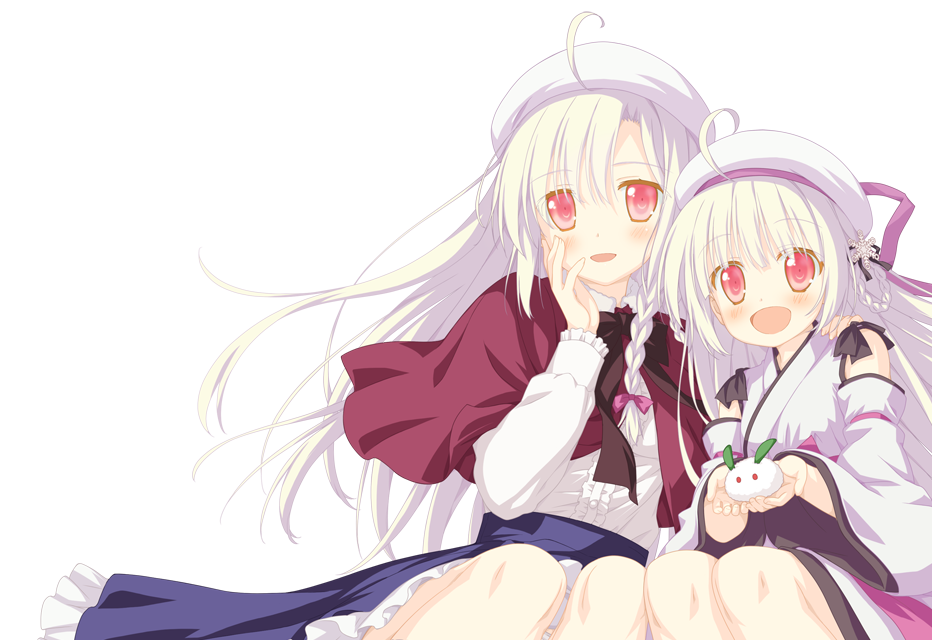

# FVP-Yuki ♡

<div align="center">
  
</div>

> A graphical unpack / repack / patch tool for games built on the **FVP engine**.

> Shiraha Yuki is so cute! ♡

**[中文文档 →](README.zh-CN.md)**

---

> ⚠️ **Disclaimer & Warning**  
> This tool is created for **educational purposes and technical research only**. Any commercial use or copyright infringement is strictly prohibited.  
> All extracted assets (images, audio, text, etc.) are the intellectual property of their respective original creators and copyright holders.  
> **Please use this tool discreetly. Do not spread it widely or use it for mass piracy distribution to avoid potential legal issues, including DMCA takedowns.** The authors of this tool assume no responsibility or liability for any consequences arising from its use.

---

## 1. Requirements

Two things are all you need:

1. Windows
2. A game that runs on the FVP engine

The tool itself ships as two files:

- `FVP-Yuki.exe` — main program (double-click to launch)
- `FVP-Yuki-Core.dll` — core library (must be in the **same folder** as the exe)

> ⚠️ **Important**: both files **must sit together**. If either is missing or placed elsewhere, the program will fail to start.

---

## 2. Where to Put the Files

The recommended approach is to copy `FVP-Yuki.exe` and `FVP-Yuki-Core.dll` **directly into the game's root directory** — the same folder that contains `xxx.hcb`, `graph.bin`, and other data files. The tool will then automatically detect all default paths without any manual configuration.

Example layout:

```
Astral Air Finale\
├── AstralAirFinale.hcb
├── graph.bin
├── voice.bin
├── se_sys.bin
├── ...
├── FVP-Yuki.exe          ← here
└── FVP-Yuki-Core.dll     ← here
```

Double-click `FVP-Yuki.exe` to start.

---

## 3. Interface Overview

The window has two tabs:

| Tab | Purpose |
| --- | --- |
| **Extract** | Unpack `.hcb` / `.bin` files to inspect their contents. |
| **Pack** | Repack edited text or images back into game-ready files. |

At the bottom of the window you will find:

- **Status bar** — tells you what the tool is doing and whether it succeeded.
- **Progress bar** — moves in real time for long tasks.
- **Current step** — a more detailed single-line description.
- **Open Result** button — jumps to the output folder when a task finishes.

---

## 4. Extracting

1. Open `FVP-Yuki.exe`.
2. Stay on the **Extract** tab.
3. Drag the file you want to inspect onto the large pink drop area:
   - `AstralAirFinale.hcb` → exports script text to `unpack\text\`
   - `graph.bin` → exports all sprites / CG / UI images to `unpack\extracted_graph\`
   - `voice.bin` / `bgm.bin` / `se_sys.bin` → exports audio to the corresponding `unpack\extracted_xxx\`
4. Wait for the progress bar to finish and the status bar to show "Extraction complete".
5. Click **Open Result** in the bottom-right to browse the output directly.

Multiple files can be dropped at once; they will be processed one by one.

---

## 5. Writing Back Translated Text

1. First extract `AstralAirFinale.hcb` as described above.
2. Open `unpack\text\`. You will find `lines.jsonl` and `output.txt` — pick the format you prefer:
   - `lines.jsonl` — one JSON record per line; fill in the `translated_text` field. **Recommended** — carries richer metadata.
   - `output.txt` — plain-text format; place your translated lines on the rows beginning with `@`.
3. Switch to the **Pack** tab.
4. The "Source HCB", "Translation File", and "Output HCB" fields should already be filled. If not, click **Refresh Default Paths** (top-right) or use **Browse** to set them manually.
5. Click **Pack Text ♡** (bottom-right).
6. After a few seconds, `output.hcb` will appear in the working directory.
7. Copy `output.hcb` back to the game folder — the game will load it in preference to the original.

> 💡 If your translation file is `.jsonl`, keep "Input Format" set to `auto`; the tool will detect it automatically.

---

## 6. Replacing Images / CG / Audio

1. Extract the relevant `.bin` first (e.g., `graph.bin`).
2. Browse `unpack\extracted_graph\preview\` — these are **PNG previews** of every asset. Find the one you want to replace.
3. Edit that PNG with any image editor. **Keep the filename identical** and **keep the canvas size the same**.
4. Go to the **Pack** tab → "Repack Single BIN" card:
   - Select `unpack\extracted_graph` (or the relevant folder) from the "Asset Directory" dropdown. Click **Refresh** if it does not appear.
   - "Output BIN" is pre-filled by default.
   - Leave **Auto-Rebuild PNG** checked — this re-encodes modified PNGs into the game's native format.
5. Click **Repack BIN ✿**.
6. Replace the original `.bin` file with the newly generated one.

Audio works the same way: replace the `.hzc1` / `.ogg` files inside `raw\` (keep the original filename).

---

## 7. One-Click Patch Build (for distribution)

If you have changed both text **and** images/audio and want to bundle everything at once:

1. Make sure `unpack\text\` and all `unpack\extracted_xxx\` folders contain your latest edits.
2. Switch to the **Pack** tab and find the "One-Click Patch Build" card at the bottom.
3. Set "Output Directory" (default: `patch_build\`) or leave it as-is.
4. Click **Build Patch ♡**.
5. When done, the output directory will contain:
   - A new `output.hcb`
   - All modified `.bin` files
   - `patch_build_report.json` — lists everything that changed
6. Archive these files and share them. Recipients drop them into the game folder to apply the full translation/mod patch.

Enable **Include Unchanged** to also output unmodified `.bin` files (larger bundle, useful for a clean full repack).

---

## 8. FAQ

**Q: The exe closes immediately after double-clicking.**
A: `FVP-Yuki-Core.dll` is almost certainly missing from the same directory. Check the placement.

**Q: Nothing happens after dropping a file.**
A: Only `.hcb` and `.bin` are supported. For other formats (e.g., `.anz`) use GARbro.

**Q: The game crashes on startup.**
A: A translated line in `output.hcb` may contain an unsupported character or be too long. Check the "Current Step" error message, or temporarily restore the original `AstralAirFinale.hcb` to isolate the issue.

**Q: I replaced a PNG but nothing changed in-game.**
A: Either "Auto-Rebuild PNG" was unchecked during repack, or the replacement PNG has different dimensions. Fix and repack.

**Q: I want to start fresh.**
A: Click **Reset State** in the bottom-right at any time.

---

## 9. Directory Reference

| Path | Contents |
| --- | --- |
| `unpack\text\lines.jsonl` | Structured translation file (recommended for editing) |
| `unpack\text\output.txt` | Plain-text translation file |
| `unpack\extracted_graph\preview\` | PNG previews for editing |
| `unpack\extracted_graph\raw\` | Raw hzc1 image data |
| `unpack\extracted_voice\raw\` | Raw voice data |
| `output.hcb` | Packed text output — copy to game folder to apply |
| `patch_build\` | One-click patch build output |

---

## 10. Building from Source

Requirements:

- **Visual Studio 2022** with the "Desktop development with C++" and "C++/CLI support" workloads installed.

Open `FVP-Yuki.sln`, select `Release | x64`, and choose **Build Solution**.

Or from the command line:

```powershell
msbuild FVP-Yuki.sln /p:Configuration=Release /p:Platform=x64
```

Output is placed in `build\Release\`:

- `FVP-Yuki.exe` — GUI host (C++/CLI, requires .NET Framework 4.x, built into Windows 10/11)
- `FVP-Yuki-Core.dll` — core library (native C++, exports the `PackCpp*` API family)

### Project Structure

```
FVP-Yuki/
├── FVP-Yuki.sln                Solution file
├── FVP-Yuki.vcxproj            GUI EXE project (C++/CLI)
├── FVP-Yuki-Core.vcxproj       Core DLL project (native C++)
├── src/                        DLL source
│   ├── common.{h,cpp}          Shared utilities: encoding, hashing, JSON, paths
│   ├── text_codec.{h,cpp}      Shift_JIS / GBK auto-detection
│   ├── hcb.{h,cpp}             HCB script text extraction and rewrite
│   ├── hzc1.{h,cpp}            HZC1 image decode / PNG round-trip
│   ├── archive.{h,cpp}         BIN container unpack, repack, and patch build
│   ├── core_exports.{h,cpp}    Public P/Invoke interface
├── ui/                         GUI source
│   ├── main.cpp                wWinMain entry point
│   ├── MainForm.h              WinForms main window
│   └── app.rc                  Icon and background resources
├── static/                     Icons and window background image
└── README.md
```

---

Enjoy your patching! ✿

